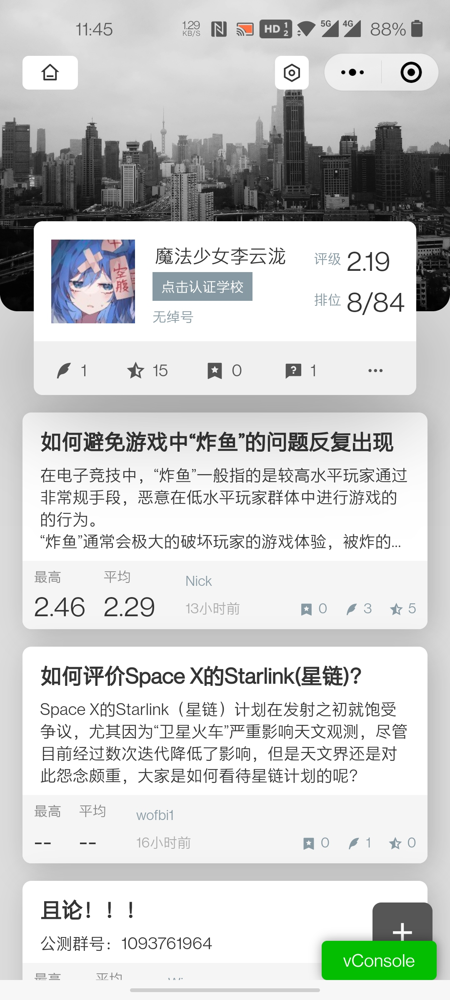
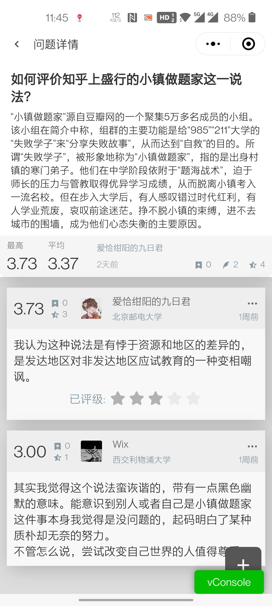

# 个人简历

> 若您看到的是 PDF 文档，建议访问 www.b-tree.studio/resume 以获得更好的阅读体验

- 张家平 / 男 / 2001
- 本科在读 / 福建工程学院 物联网工程
- 技术博客：[https://www.b-tree.studio/blog](https://www.b-tree.studio/blog)
- Github：[https://github.com/PentaTea](https://github.com/PentaTea)
- 期望职位：前端开发，嵌入式研发工程师，产品设计师

## 联系方式

- 手机：13864029857 （微信同号）
- Email：PentaTea@B-Tree.Studio
- QQ：2490445193

## 工作或实习经历

### 且论（ 2020 年 8 月至今 ）

项目状态：已上线，公测中

小程序搜索"且论"可以查看

大学生创业项目，本人担任职责：小程序和 app 前端，产品原型设计，产品 UI/UX 设计

### 大疆 robomaster 暑期营（实习）

#### 嵌入式方向（ 2019 年 7 月 ~ 2019 年 8 月 ）（ 2019 年 1 月 ~ 2019 年 2 月 ）

负责了步兵机器人的控制学计算与整机的指令控制，提出了纸杯投放器的整体设计，参与了其他机械方面的方案设计与诸多组件的建模，实现了基于 ROS 和 FreeRTOS 的控制自动化，并为算法同学写了 GUI 的测试用例。虽然最终算法对接出了问题，但我作为操作手与其他队伍的算法对战并赢下数场比赛。此间最自豪的技术细节是在前期架构方面引入了命令 - 工厂的设计模式，尽管在比赛前一晚才拿到拼装好的机械臂等组件成品，优雅健壮的架构仍让我在几小时内完成了所有程序代码，最终赢得季军。

## 项目和作品

### 开源项目

#### [vuepress-plugin-music-bar](https://www.npmjs.com/package/vuepress-plugin-music-bar)

vuepress的音乐插件，最高周下载一千，已收录于[awesome-vuepress](https://github.com/vuepressjs/awesome-vuepress)

#### [robot-茶茶](https://github.com/PentaTea/robot-chacha)

基于[CQHTTP](https://cqhttp.cc/)的机器人，我在底层[Koishi.js](https://github.com/koishijs/koishi)的基础上实现了以依赖注入为核心模式的框架，可以很方便的以`服务`的方式添加功能

#### [vs-paste-img](https://github.com/PentaTea/vs-paste-img-from-clipboard)

Visual Studio Code 插件，在 MarkDown 文件中调用[PicGo-Core](https://github.com/PicGo/PicGo-Core)获取剪切板图片下载到设定目录，并粘贴 md 格式的引用链接至光标位置

其他：[https://github.com/PentaTea](https://github.com/PentaTea)

### 未开源项目

#### [AR 眼镜](https://www.b-tree.studio/blog/post/AR眼镜/)

### 技术文章

- [JavaScript 学习笔记](https://www.b-tree.studio/blog/post/js学习笔记/)
- [VSCode 源码研读](https://www.b-tree.studio/blog/post/vscode源码研读/)
- [依赖注入学习](https://www.b-tree.studio/blog/post/依赖注入/)

### 公开演讲

- 2020/09 物联网导论演讲: [人工智能的发展揭示了人类学习的原理](https://www.b-tree.studio/blog/post/人工智能的发展揭示了人类学习的原理/)

## 自我评价

本人拥有五年以上的编程经验，使用过各领域下的开发语言。2019 年通过了哈工大的自主招生和港科大 isdn 初试（面试英语不过关）。接单经验丰富，可以快速理解客户需求，参与过多种语言或框架的项目，拥有从零构建产品的能力。拥有较强的学习能力，快速学习，快速阅读相关文档并应用的能力。在项目中具备撰写文档，总结问题的能力，经常运用设计模式，写单元测试，努力写出具有易读，易维护，易扩展的代码。
本人拥有较强的人际交往能力，与同事相处融洽，也会独立思考，技术均有涉猎，拥有与各领域同事交流讨论的能力。

综上，本人可以胜任各种角色的职位，拥有较强的适应能力，相信自己可以满足客户的各项要求。

## 技能清单

以下为我常用到的技术栈或技能：

- 编程语言：`Clang`/`C++`/`HTML`/`CSS`/`JS`/`TS`/`Python`/`Shell` 等
- 嵌入式设计
  - 原型：`Procreate`/`Blender`
  - 硬件：`立创EDA`/`AD`/`Cadence Allegro`
  - 开发：`裸机Clang`/`hal`/`mbed`/`FreeRTOS` 等
- Web 相关
  - 设计：`Adobe XD`/`Procreate`
  - 开发：`NodeJS前后端`/`小程序`
  - 框架：`Vue`/`jQuery`/`uni-app`/`three.js`/`electron` 等
  - 工具：`TypeScript`/`Scss`/`Stylus`/`Axios`/`pm2`/`Webpack` 等
  - 测试：`Jest`
- 产品相关：`产品设计`/`UI设计`/`UX设计`
- 数据库：`MySQL`
- 版本管理：`Git`
- 文档和自动化部署工具：`Vuepress`/`Hexo` 等
- 其他如`正则匹配`，`设计模式`，`SVG`，`MarkDown`，`JSON` 等

## 致谢

- 感谢您花时间阅读我的简历，期待能有机会和您共事。
- 感谢本简历模板的提供方 【冷熊简历】
- 感谢 coding 提供的静态站点托管服务
