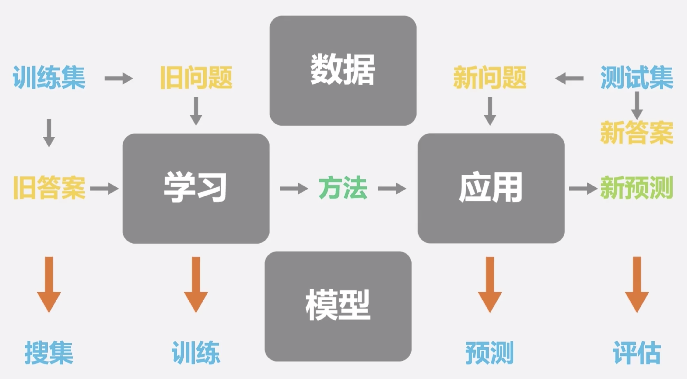
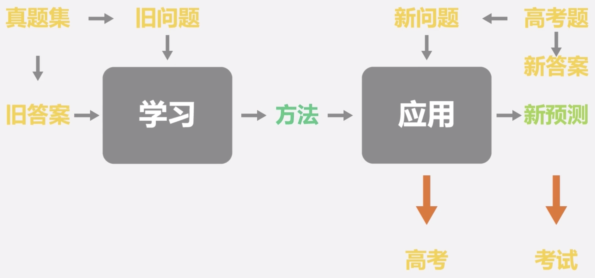

# 人工智能的发展揭示了人类学习的原理

> 「摘要」论当今信息产业涌现发展的规律及神经网络深度学习技术对大学生学习规划的启示

> 「关键词」人工智能；深度学习；信息产业发展；

人工智能，神经网络，深度学习是当今最流行的明星算法，但它对人类社会最大的贡献不是解决了多少问题，而是揭示了人类学习的原理。

## 涌现

我们都知道实现功能的最小单位是蛋白质，虽然单个蛋白质能实现的功能只相当于开关门那么简单，但大量蛋白质有组织并行工作就有了质变，试想一栋高楼只是由简单的砖块和其他建筑类材料构成的，每一个体材料都很小，少量简单的胡乱堆叠只会形成一堆垃圾，而大量而有序的结合却可以构成更高级的结构，单个蛋白质的功能非常简单，经过漫长的演化过程却出现了如此多的生命体，这种由量变引起质变的现象就是涌现（emergence）。

涌现可以跃进式的增强体系发展，比如寒武纪生命大爆发，蚂蚁社群，免疫系统，以及现在的人类文明，尤其是互联网以及信息产业。

## 指数级发展

随着体系的发展和系统信息的积累，涌现得到的知识又会缩短下一次涌现的出现。在没有任何限制下，周期不断变短的连续涌现造成了当今人类文明的爆炸式的指数级发展，从而更加加快了体系信息积累的速度，而更快的信息累积则会造成更频繁的涌现，直到任何人都无法预测人类科技树几年，几个月，几天，甚至几小时后的样子，正应了斯宾塞·约翰逊那句“世界上唯一不变的是变化本身”。

## 学习本质

生物体任何的决策都是为了更好的生存（维持自身低熵条件），而想要存活就必须通过学习已有情况的知识来预测未知情况。地球上第一个学习系统是演化——通过大量的突变克隆体尝试、询问环境，不能预测危机发生的个体都会被环境淘汰，以牺牲一部分个体为代价来筛选出能正确的预测模型以稳定熵减。而随着个体生长周期和成本的增加，一些复杂生命体演化出了的第二种学习方法——神经网络，允许个体不再以死亡为代价来学习模型。

人工神经网络的运行机制：

用搜集来的训练集中的问题和答案来训练模型，用测试集来测试模型的质量，训练好的模型可以去解决实际从没遇到过的问题。

而这是由神经网络算法的启示的人类学习机制：

利用习题和练习册来训练自己的做题能力，用周测月考期末考试等测试来检测学习质量，最终的目的是解决高考当中的从未遇到过的问题。

**即学习的本质就是利用已有的样本找到规律，以此来解决未来的新问题。**

## 启示

> “站在风口上，猪都能飞起来”

在当今指数级发展的互联网信息风口当中，如何成为那个站在巨人肩膀上，抓住一次次涌现的机会，扶摇直上的猪？很多人以为雷总是借台风，其实难的是长翅膀，更难的是飞得更高而不被台风吹得乱飞，最难的是平稳降落摔不死。所以要加紧磨练技能，拓宽眼界，锻炼项目能力，努力生长羽翼。

而最重要的就是项目实践能力，因为在书本上学到的只是知识的描述，甚至是滞后了相当一段时间的理论，面对当前日新月异的世界就显得力不从心。而用足够的样本来训练自己，才能在未来解决新的问题，这是人工神经网络带给我们的启示。

## 最后

从有演化这个第一套学习系统开始至少经历了 20 亿年的不断试错才出现了神经网络这个第二套学习系统。

而神经网络在此之后依然不断完善，如今已经发展成人类大脑，可以允许我们在个体生命周期内学习知识来预测信息。也帮助人工智能用深度学习算法使语音、图像等识别达到了人类水平。

这也给大多数普通人的未来工作带来了巨大的挑战，因为知识是我们获得信息的源泉，是维持自身价值的必要条件。计算机已经可以根据信息来归纳知识，但很多人却还像十几年前的计算机一样去记忆信息，天真的认为人脑的容量是无限的，认为人类是不可代替的。可在这种毫无创造性的任务当中，作为人类并不会比计算机做的更好。

**讽刺的是，我们教会了计算机如何学习，却从来没有教过学生如何使用演化出来的大脑。**
