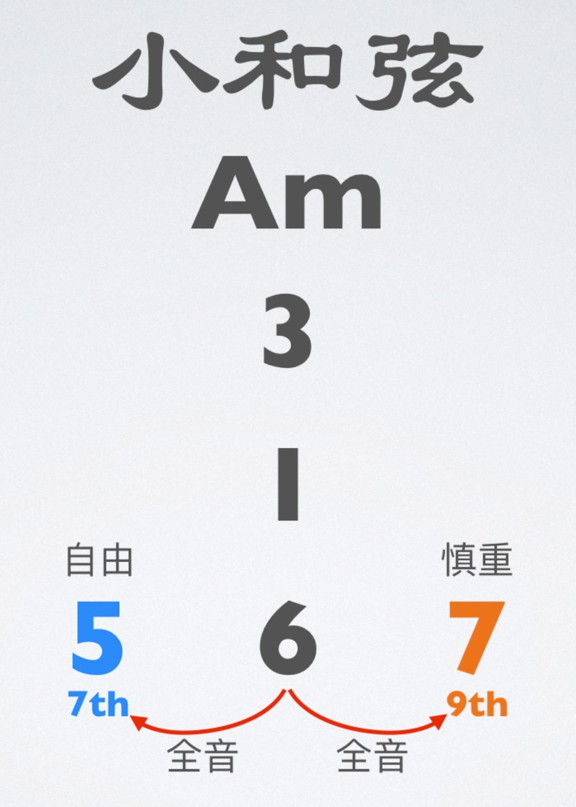
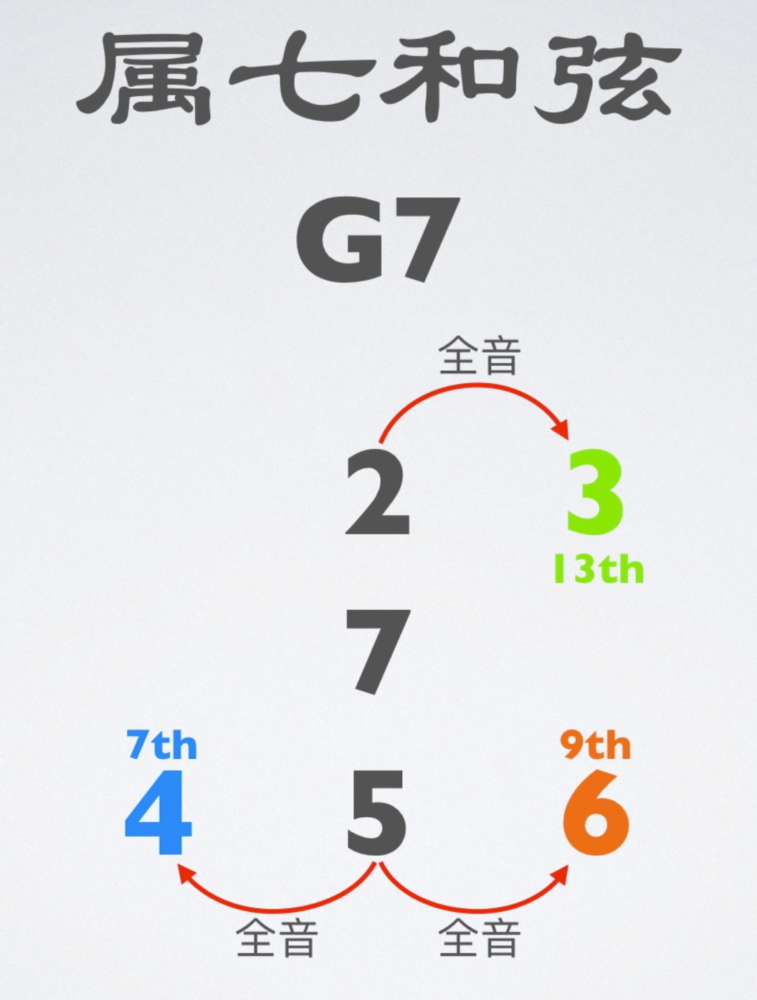
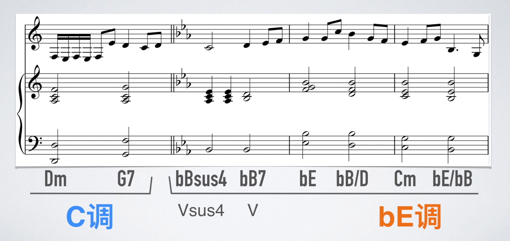
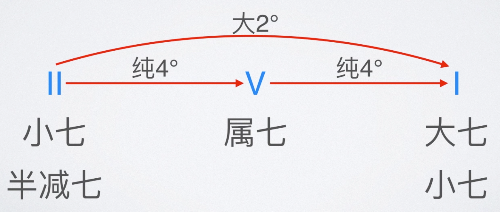
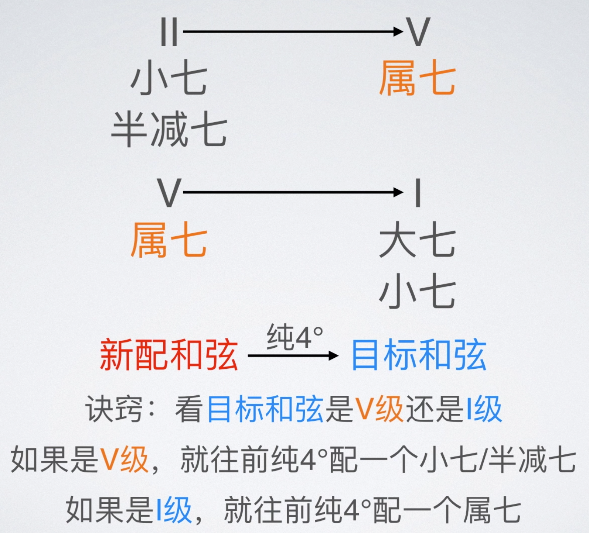
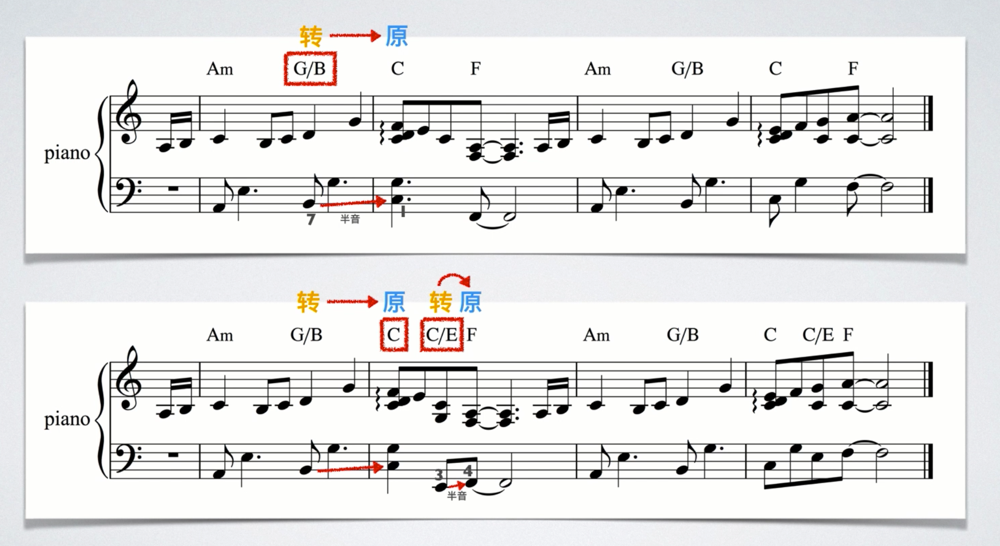
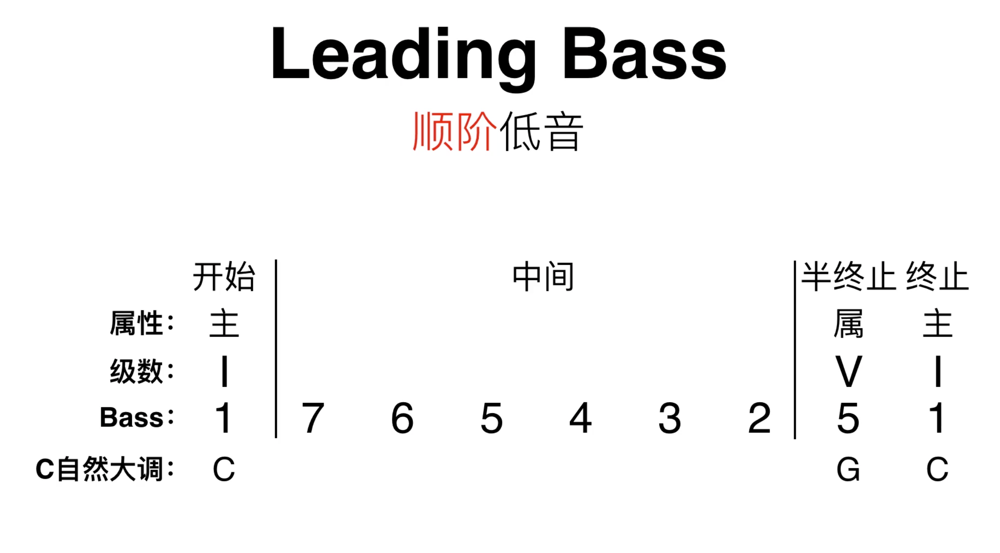

# 流行和声理论

- 属和弦前可以加一个挂四和弦加强终止感
- 转调离调都可以用
- 流行音乐可以用一些爵士理论，但过犹不及

## 丰富和弦色彩

### 丰富声部

### 转调

找到目标调的属和弦

### II V I 进行

个人理解不稳定 → 很不稳定 → 稳定

不一定必须是当前音阶的 251 ，只要满足音程关系就可以

也不一定是完整的 251 ，可以在目标和弦前面配和弦。

- 加的太多会有冗余感
- 转位和弦不太适合做目标和弦，转位弱化了该和弦的功能，使得其作为离调上的功能没那么强，但不一定
- 251 会受旋律限制（小二度）（当然也可以改旋律）

### 第一转位的运用

### 演奏五声音阶

详见爵士理论

## 经典和声进行

### Leading Bass

- 除了主和弦，其他和弦不能把 5 音作为低音
- 如果低音正好是和弦根音就尽量配这个和弦
- 注意和弦感情，比如不要把半终止配到前面去

### 四度圈

### 其他

[其他经典和声进行](https://www.bilibili.com/video/BV1Hx411S7zm?p=33)

## 终止法

### 大七和弦终止法

大七和弦具有开始和结束的功能

- 注意与旋律配合

### 降六降七终止法

在属七和弦和终止之间插降六降七（所以只能用在大调上）

- 降六级可以随便选，也可以使用 `包含旋律音的和弦` + `大二度和弦` ＋ `大二度和弦` 的组合

### 六级终止法

在属七和弦和终止之间插六级阻碍终止，后面再弹点东西

### 利底亚音阶终止法

详见爵士理论（只能用在大调上）

## 就近解决规则

- 声部最好异向进行
- 最好不要连续出现两个纯五度

就近解决：各声部的进行不要超过三度
