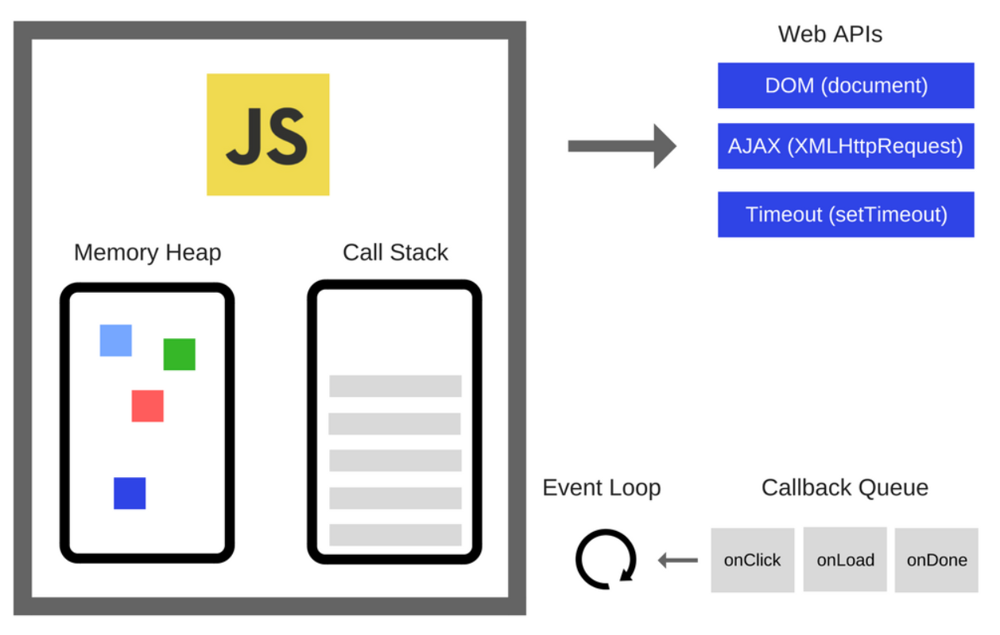

# JavaScript 学习笔记

## 引擎

如 v8 引擎，



其由两部分组成

- 内存堆：内存分配的地方
- 调用栈：代码执行的地方

在运行时，根据环境会有其他相关 API (nodeAPIs,WebAPIs) 以及事件循环，回调队列等

## 调用栈（执行栈）

调用栈记录了当前程序运行的位置，存储运行时创建的所有执行上下文

JavaScript 脚本开始执行时，引擎会创建全局执行上下文并压入调用栈

当遇到对象定义，会将其记录到当前上下文中，遇到函数调用，会为该函数创建新的执行上下文并压入栈顶

当函数执行结束时，当前执行上下文出栈并释放相关空间

调用栈是 LIFO 的栈，所以也会发生栈溢出的情况

## 执行上下文

- 全局执行上下文
- 函数执行上下文
- Eval 函数执行上下文

### 创建阶段

在本阶段中会发生：

- this 值的确定
- 创建词法环境
- 创建变量环境

```JS
ExecutionContext = {
  ThisBinding = <this value>,
  LexicalEnvironment = { ... },
  VariableEnvironment = { ... },
}
```

#### this 绑定

全局执行上下文中，this 的值指向全局对象

函数执行上下文中，this 的值取决于函数如何被调用

#### 词法环境（周围状态）

词法环境是一种持有`标识符` $\longmapsto$ `变量`映射的结构，`标识符`指的是变量，函数的名字，`变量`是对**实际对象**或**原始数据**的引用

词法环境的两个组件：

1. 环境记录器 存储变量和函数声明的实际位置
2. 外部环境的引用 访问其父级词法环境（作用域）

词法环境的两种类型：

1. 全局环境中**没有**外部环境引用 (null) ，拥有的`对象环境记录器`定义全局关系
2. 函数环境中**有**外部环境引用（全局或其他外部函数），拥有的`声明式环境记录器`存储变量，函数和参数

> 声明式环境记录器还包含了给函数的 arguments 对象和其 length

```JS
GlobalExectionContext = {
  LexicalEnvironment: {
    EnvironmentRecord: {
      Type: "Object",
      // 绑定标识符
    }
    outer: <null>
  }
}

FunctionExectionContext = {
  LexicalEnvironment: {
    EnvironmentRecord: {
      Type: "Declarative",
      // 绑定标识符
    }
    outer: <Global or outer function environment reference>
  }
}
```

#### 变量环境

变量环境也是一个词法环境，它的环境记录器持有**变量声明语句**在执行上下文中创建的绑定关系。

词法环境| 变量环境
-----|-----
存储函数声明和变量（let 和 const）绑定|只用来存储 var 变量绑定

样例：

``` JS
let a = 20;
const b = 30;
var c;

function multiply(e, f) {
 var g = 20;
 return e * f * g;
}

c = multiply(20, 30);
```

遇到调用函数 multiply 时创建的执行上下文：

``` JS
GlobalExectionContext = {

  ThisBinding: <Global Object>, // this 指向

  LexicalEnvironment: {
    EnvironmentRecord: {
      Type: "Object",
      // 在这里绑定标识符
      a: <uninitialized>, // let a = 20;
      b: <uninitialized>, // const b = 30;
      multiply: <func>    // function multiply(e, f) {...}
    }
    outer: <null> // 无外部环境引用
  },

  VariableEnvironment: {
    EnvironmentRecord: {
      Type: "Object",
      // 在这里绑定标识符
      c: undefined, // var c;
    }
    outer: <null>
  }
}

FunctionExectionContext = {
  ThisBinding: <Global Object>, // this 指向

  LexicalEnvironment: {
    EnvironmentRecord: {
      Type: "Declarative",
      // 在这里绑定标识符
      Arguments: {0: 20, 1: 30, length: 2}, // 参数
    },
    outer: <GlobalLexicalEnvironment> // 外部环境引用
  },

VariableEnvironment: {
    EnvironmentRecord: {
      Type: "Declarative",
      // 在这里绑定标识符
      g: undefined //var g = 20;
    },
    outer: <GlobalLexicalEnvironment>
  }
}

```

引擎检出变量和函数声明，词法环境仅仅记录 let 与 const 变量，并没有关联任何值，而变量环境将`var`变量设为`undefined`

所以可以在声明之前访问`var`定义的变量

这就是变量提升

变量提升的原因：
1. 提高性能
2. 增加容错性

### 执行阶段

引擎会完成变量分配，执行代码

## 事件循环

javascript 是单线程语言，可以用同步的方法去模拟异步

不同 JS 引擎的宿主环境都拥有的一个内置执行机制

某些异步操作向环境 API 注册相关监听，触发时会把相关函数入队进回调队列

事件循环会监控调用栈和回调队列，如果调用栈是空的，它就会执行回调队列的出队操作，然后将相关函数压入到调用栈中，然后运行它。

### 异步方式

#### 回调

最常用基础的异步方式

#### Promise

一个容器，保存着某个未来才会结束的事件的结果

Promise 对象特性：
1. 状态不受外界影响，拥有三种状态：`pending`（进行中）、`fulfilled`（已成功）和 `rejected`（已失败）
2. 状态凝固并存续，称为 `resolved`（已定型）

#### async/await

async function 定义一个返回 AsyncFunction 对象的异步函数。

异步函数是指通过事件循环异步执行的函数，它会返回一个 Promise

await 只能使用在 async function 中，允许你同步等待一个 Promise

## 数据类型

### 基本类型

`非对象` ， `无方法`
7 种基本类型： `string` ， `number` ， `bigint` ， `boolean` ， `null` ， `undefined` ， `symbol`
基本类型的值**不可改变**

#### 基本类型包装对象

- 字符串基本类型 `String`
- 数值基本类型 `Number`
- 大整数基本类型 `BigInt`
- 布尔基本类型 `Boolean`
- 字面量基本类型 `Symbol`
  用 valueOf() 方法返回基本类型值

### 引用类型

- 对象 `Object`
- 数组 `Array`
- 函数 `Function`

### 区别

| &nbsp;   | 基本类型                | 引用类型         |
| -------- | ----------------------- | ---------------- |
| 本质     | **值**                  | **指针**         |
| 占用空间 | 固定                    | 不固定           |
| 存储位置 | [调用栈](/blog/post/js原理-运行) | 堆(栈中存有指针)|
| 检测类型 | typeof                  | instanceof       |

## 数字

JavaScript 数字全部是双精度规范浮点数

所以会有

``` JS
0.1 + 0.2 //0.30000000000000004
0.1 + 0.2 == 0.3 // false
```

只要记住数学操作一定要用库就行

## this, call, apply, bind

### this

this 永远指向最后调用它的那个对象，因为在调用时才会[创建执行上下文并绑定 this](/blog/post/js原理-运行#this-绑定)

### 改变 this 指向

- 使用 ES6 的箭头函数
- 在函数内部使用 _this = this
- 使用 apply、call、bind
- new 实例化一个对象

#### 箭头函数

箭头函数的 this 始终指向函数定义时的 this，而非执行时

#### _this = this

将上层执行上下文中的 this 保存并在其他地方使用

#### apply()

`function.apply(thisArg, [argsArray])`

指定函数的 this 值，提供**参数数组**并**运行**

#### call()

`function.call(thisArg[, arg1[, arg2[, ...]]])`

指定函数的 this 值，提供**参数表**并**运行**

#### bind()

`function.bind(thisArg[, arg1[, arg2[, ...]]])`

指定函数的 this 值，并提供**参数表**并**返回新函数**
