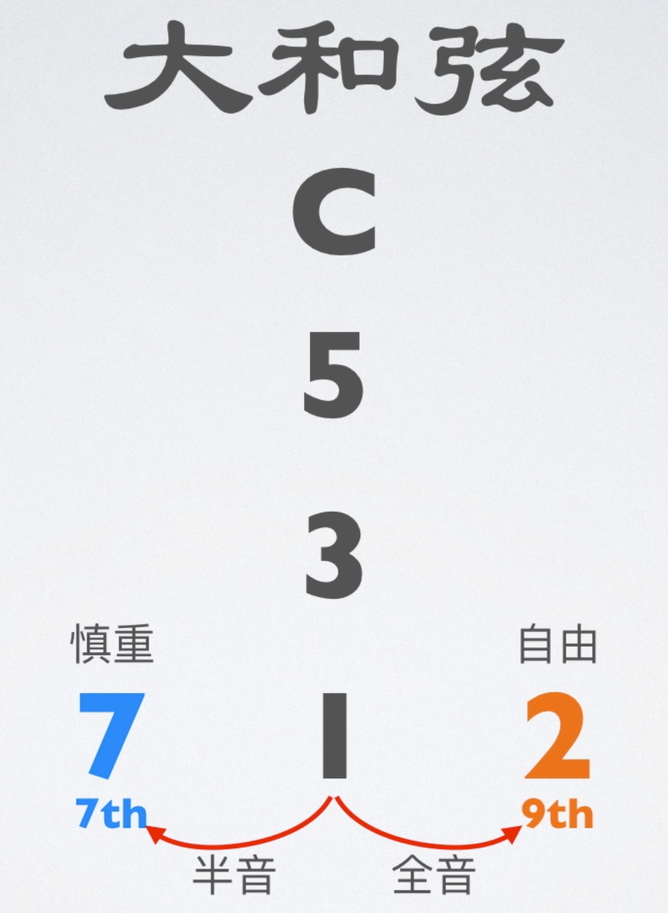
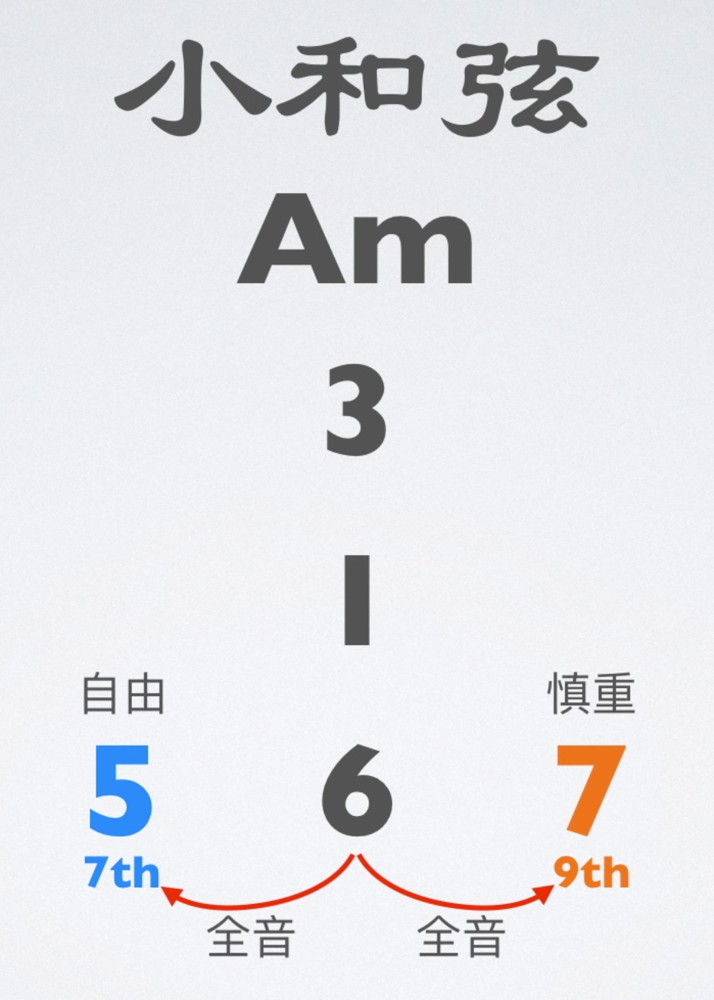
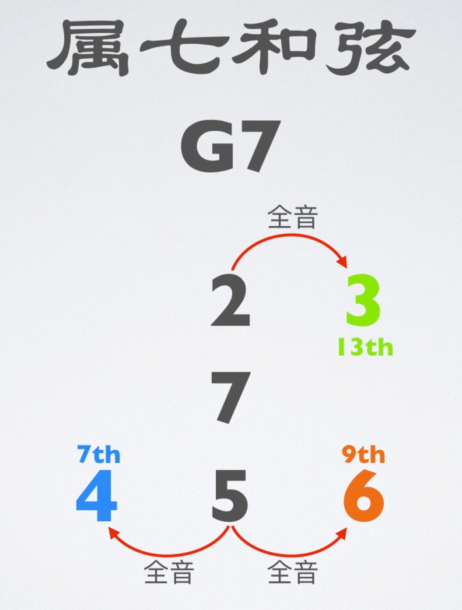
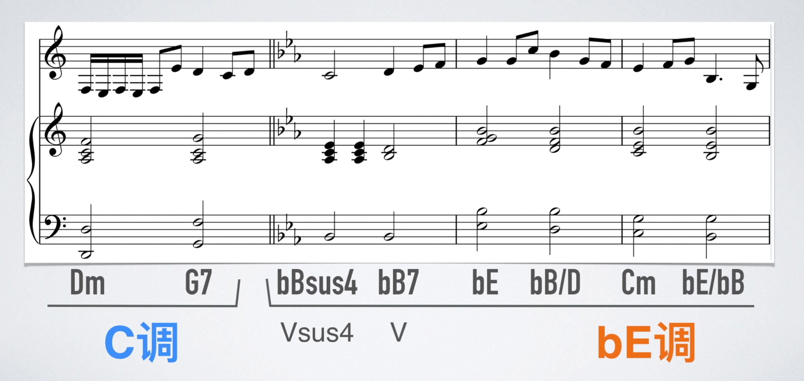
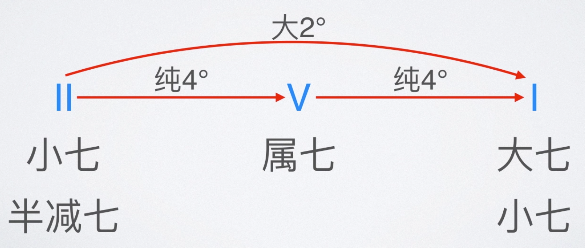
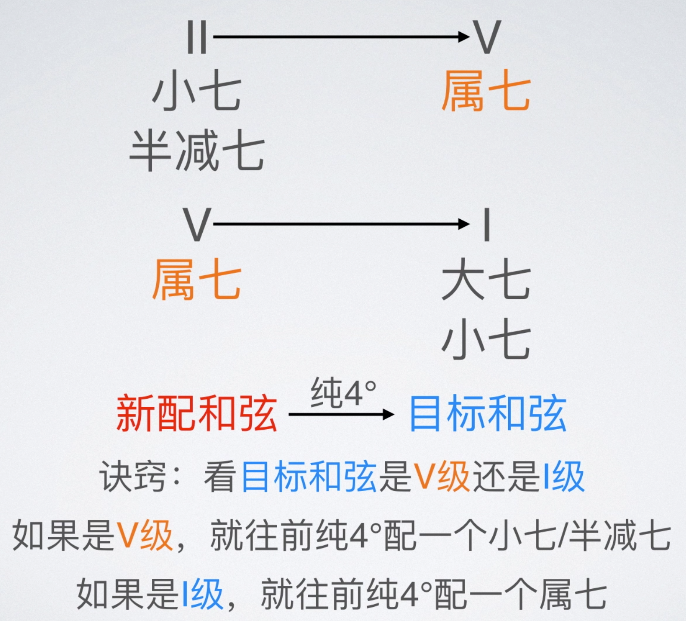
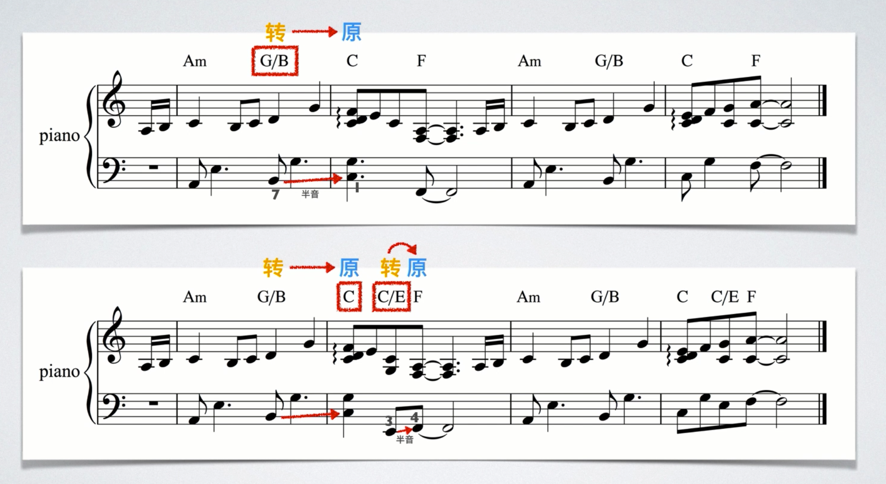
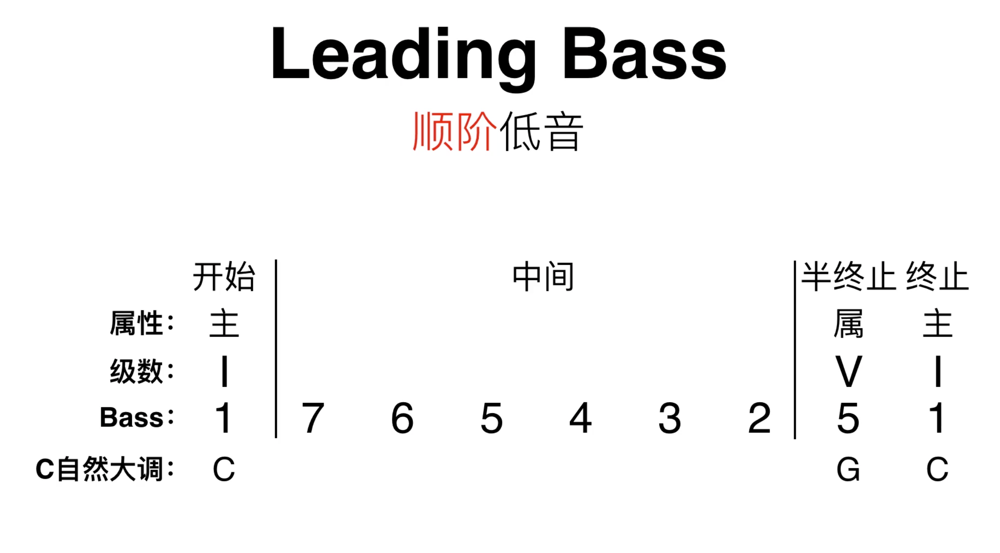
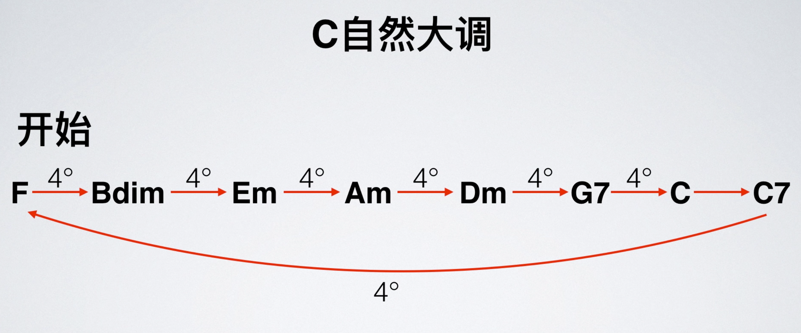

# 流行和声理论

- 属和弦前可以加一个挂四和弦增强终止感
- 转调离调都可以用
- 流行音乐可以用一些爵士理论，但过犹不及

## 丰富和弦色彩

### 丰富声部

### 转调

找到目标调的属和弦

### II V I 进行

个人理解不稳定 → 很不稳定 → 稳定

不一定必须是当前音阶的 251 ，只要满足音程关系就可以

也不一定是完整的 251 ，可以在目标和弦前面配和弦。

- 加的太多会有冗余感
- 转位和弦不太适合做目标和弦，转位弱化了该和弦的功能，使得其作为离调上的功能没那么强，但不一定
- 251 会受旋律限制（小二度）（当然也可以改旋律）

### 第一转位的运用

### 演奏五声音阶

详见爵士理论

## 经典和声进行

### Leading Bass

- 除了主和弦，其他和弦不能把 5 音作为低音
- 如果低音正好是和弦根音就尽量配这个和弦
- 注意和弦感情，比如不要把半终止配到前面去

### 四度圈

### 其他

[其他经典和声进行](https://www.bilibili.com/video/BV1Hx411S7zm?p=33)

## 终止法

### 大七和弦终止法

大七和弦具有开始和结束的功能

- 注意与旋律配合

### 降六降七终止法

在属七和弦和终止之间插降六降七（所以只能用在大调上）

- 降六级可以随便选，也可以使用 `包含旋律音的和弦` + `大二度和弦` ＋ `大二度和弦` 的组合

### 六级终止法

在属七和弦和终止之间插六级阻碍终止，后面再弹点东西

### 利底亚音阶终止法

详见爵士理论（只能用在大调上）

## 就近解决规则

- 声部最好异向进行
- 最好不要连续出现两个纯五度

就近解决：各声部的进行不要超过三度

## 调性的感情色彩

| 调性    | 色彩   | 感情               |
| ------- | ------ | ---------------- |
| C 大调 &nbsp; &nbsp; &nbsp; | 纯白色 &nbsp; &nbsp; &nbsp;| 最纯洁、最初始     |
| c 小调  | 纯黑色 | 抗争、奋斗         |
| #C 大调 | 奶白   | 阳光、纯洁         |
| #c 小调 | 深褐   | 痛苦、呻吟、       |
| D 大调  | 纯绿色 | 质朴、自然、天然   |
| d 小调  | 墨绿   | 思想深刻、沉思     |
| bE 大调 | 淡黄   | 光明、明亮         |
| be 小调 | 明黄   | 充满灵感、思维活跃 |
| E 大调  | 纯黄色 | 灿烂、光辉         |
| e 小调  | 深蓝色 | 忧郁、悲伤         |
| F 大调  | 淡红色 | 温暖               |
| f 小调  | 深红色 | 悲愁哀伤、悲愁     |
| #F 大调 | 鲜红   | 明朗、有魅力       |
| #f 小调 | 暗红   | 寂寞、伤感         |
| G 大调  | 大红色 | 非常温暖           |
| g 小调  | 海蓝色 | 怀念、思念、伤感   |
| bA 大调 | 明黄   | 坚定有力、有气势   |
| #g 小调 | 淡蓝   | 轻松、欢快、优美   |
| A 大调  | 金黄色 | 宏伟、辉煌         |
| a 小调  | 纯蓝色 | 惆怅、忧伤         |
| bB 大调 | 淡粉   | 活泼、轻盈         |
| bb 小调 | 棕黄   | 庄严、虔诚、忏悔   |
| B 大调  | 银白色 | 高雅明丽           |
| b 小调  | 暗灰色 | 悲怆、断肠、冷峻   |
