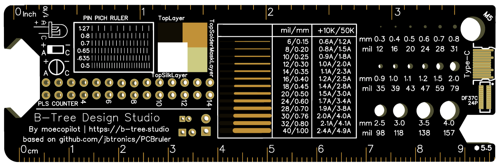
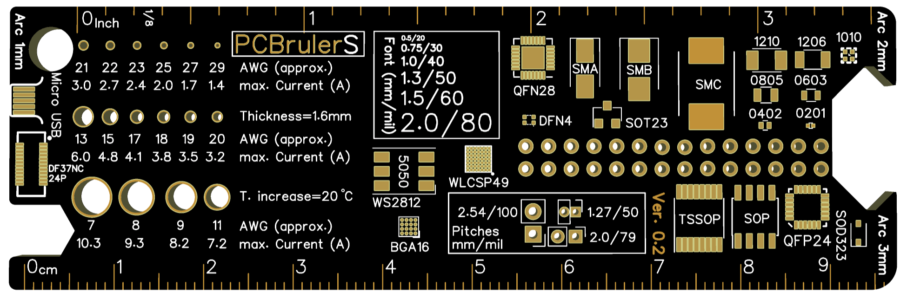

# 木尺｜ WoodMeasure 0.2

> 论当今设计师如何优雅的暴露身份

:::: el-alert title="暂未发售" type="warning" description="我现在没有台锯啊啊！等我回家再说。" show-icon

::::

↓这里有个动画，如果加载不出来可以多等一下 emmm

<SP file="/assets/svg/PCBRuler.svg" start="autostart"/>

## 介绍

这是一把 PCB 制成的尺子，通过它，我们可以为你提供诸多有趣的 function。

### 特性

- 10×3 厘米小尺寸
- 公制与 $\frac{1}{8}$ 和 $\frac{1}{10}$ 细分的英制刻度线
- M3 螺母的 5.5mm 扳手槽孔
- 两排带有标记的 2.54mm 焊盘，用于计数和掰断排针
- 六种测量芯片引脚间距的刻度
- 常用贴片封装图
- Type-c 和 Microusb 的尺寸图
- 发光二极管，钽电容和电解电容的极性标注
- PCB 板顶层，阻焊层，丝印层的标注
- 边框为三种圆角设计（1 / 2 / 3mm），用以预测在设计 PCB 圆角时的外观
- 以毫米和密耳为单位的走线宽度表，并标注了相应宽度下温升 10K 和 50K 时的电流容量
- 通孔尺寸表，正面标注了以毫米和密耳为单位的尺寸，底部标注了其 AWG 数值以及电流承载
- 三种焊盘间距（2.54 / 1.27 / 2.00mm）
- 以毫米和密耳为单位的字体尺寸表
- 5mm 的通孔（可以栓绳）
- 开瓶器
- 无铅喷锡或沉金工艺

